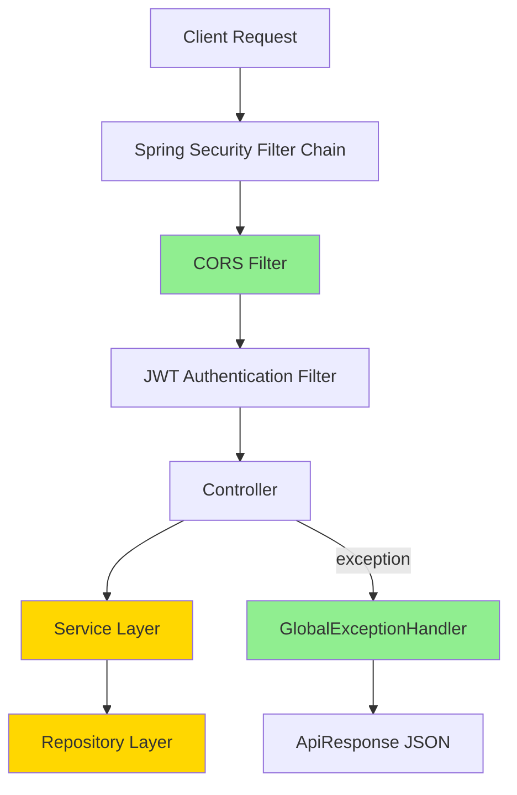

# Dokumen Desain: Auth Service Improvement

## Overview

Dokumen ini menjelaskan desain teknis untuk tiga perbaikan pada auth-service:

1. **Penanganan Error Login** — Mengganti `RuntimeException` dengan custom `AuthenticationException` dan menambahkan `GlobalExceptionHandler` menggunakan `@ControllerAdvice`.
2. **Konfigurasi CORS** — Menambahkan konfigurasi CORS yang terintegrasi dengan Spring Security filter chain, dengan allowed origins yang dapat dikonfigurasi melalui `application.yaml`.
3. **Perbaikan SQL Injection** — Refactoring method `countAll()` di `UserRepository` agar menggunakan parameterized query.

Ketiga perbaikan ini backward-compatible dan tidak mengubah kontrak API yang sudah ada.

## Architecture

Perubahan arsitektural bersifat minimal dan terlokalisasi:



Komponen baru (hijau) dan yang dimodifikasi (kuning):
- **Baru**: `CorsConfig` (atau integrasi di `SecurityConfig`), `GlobalExceptionHandler`, `AuthenticationException`
- **Dimodifikasi**: `AuthService.login()`, `UserRepository.countAll()`, `SecurityConfig`, `application.yaml`

## Components and Interfaces

### 1. Custom Exception: `AuthenticationException`

**Package:** `com.ib.auth.exception`

```java
public class AuthenticationException extends RuntimeException {
    public AuthenticationException(String message) {
        super(message);
    }
}
```

Catatan: Menggunakan nama `AuthenticationException` di package sendiri agar tidak konflik dengan `org.springframework.security.core.AuthenticationException`. Class ini extend `RuntimeException` sehingga tidak perlu checked exception handling.

### 2. Global Exception Handler: `GlobalExceptionHandler`

**Package:** `com.ib.auth.exception`

```java
@RestControllerAdvice
public class GlobalExceptionHandler {

    @ExceptionHandler(AuthenticationException.class)
    public ResponseEntity<ApiResponse<Void>> handleAuthenticationException(
            AuthenticationException ex) {
        ApiResponse<Void> response = new ApiResponse<>(
            false, "UNAUTHORIZED", ex.getMessage(), null
        );
        return ResponseEntity.status(HttpStatus.UNAUTHORIZED).body(response);
    }

    @ExceptionHandler(Exception.class)
    public ResponseEntity<ApiResponse<Void>> handleGenericException(
            Exception ex) {
        ApiResponse<Void> response = new ApiResponse<>(
            false, "INTERNAL_ERROR", "Terjadi kesalahan internal", null
        );
        return ResponseEntity.status(HttpStatus.INTERNAL_SERVER_ERROR).body(response);
    }
}
```

Handler ini menggunakan class `ApiResponse<T>` yang sudah ada di `com.ib.auth.common`.

### 3. Modifikasi `AuthService.login()`

Mengganti `throw new RuntimeException(...)` dengan `throw new AuthenticationException(...)`:

```java
public String login(String username, String password) {
    UserDto user = userRepository.findByUsername(username);
    if (user == null || !passwordEncoder.matches(password, user.getPassword())) {
        throw new AuthenticationException("Username atau password salah");
    }
    return jwtUtil.generateToken(user);
}
```

### 4. CORS Configuration

**Pendekatan:** Integrasi langsung di `SecurityConfig` menggunakan `CorsConfigurationSource` bean, dengan properties yang dibaca dari `application.yaml`.

**Tambahan di `application.yaml`:**

```yaml
cors:
  allowed-origins: http://localhost:3000,http://localhost:5173
```

**Konfigurasi di `SecurityConfig`:**

```java
@Value("${cors.allowed-origins}")
private String allowedOrigins;

@Bean
public CorsConfigurationSource corsConfigurationSource() {
    CorsConfiguration configuration = new CorsConfiguration();
    configuration.setAllowedOrigins(Arrays.asList(allowedOrigins.split(",")));
    configuration.setAllowedMethods(Arrays.asList("GET", "POST", "PUT", "DELETE", "OPTIONS"));
    configuration.setAllowedHeaders(Arrays.asList("Authorization", "Content-Type", "Accept"));
    configuration.setExposedHeaders(Arrays.asList("Authorization"));
    configuration.setAllowCredentials(true);

    UrlBasedCorsConfigurationSource source = new UrlBasedCorsConfigurationSource();
    source.registerCorsConfiguration("/api/**", configuration);
    return source;
}
```

**Integrasi di filter chain:**

```java
http
    .cors(cors -> cors.configurationSource(corsConfigurationSource()))
    .csrf(csrf -> csrf.disable())
    // ... sisanya tetap sama
```

### 5. Perbaikan SQL Injection pada `UserRepository.countAll()`

**Sebelum (rentan):**
```java
public int countAll(String keyword) {
    String sqlSelectCount = sqlCount;
    if (keyword != null && !keyword.equals("")) {
        keyword = keyword.toUpperCase();
        sqlSelectCount += " where ( upper(u.username) like CONCAT('%" + keyword + "%') ... )";
        return jdbcTemplate.queryForObject(sqlSelectCount, Integer.class);
    }
    return jdbcTemplate.queryForObject(sqlSelectCount, Integer.class);
}
```

**Sesudah (aman):**
```java
public int countAll(String keyword) {
    if (keyword != null && !keyword.isEmpty()) {
        keyword = keyword.toUpperCase();
        String sqlSelectCount = sqlCount +
            " where ( upper(u.username) like CONCAT('%', ?, '%') " +
            "or upper(u.first_name) like CONCAT('%', ?, '%') " +
            "or upper(u.last_name) like CONCAT('%', ?, '%') " +
            "or upper(u.role) like CONCAT('%', ?, '%') ) ";
        return jdbcTemplate.queryForObject(sqlSelectCount, Integer.class,
            keyword, keyword, keyword, keyword);
    }
    return jdbcTemplate.queryForObject(sqlCount, Integer.class);
}
```

Perubahan kunci: mengganti string concatenation (`"'%" + keyword + "%'"`) dengan placeholder `?` dan passing parameter sebagai argumen ke `queryForObject()`. Pola ini konsisten dengan method `findAll(int limit, int offset, String keyword)` yang sudah benar.

## Data Models

Tidak ada perubahan pada model data. Struktur `ApiResponse<T>` yang sudah ada digunakan kembali:

```java
public class ApiResponse<T> {
    private boolean success;    // true/false
    private String code;        // "UNAUTHORIZED", "INTERNAL_ERROR", dll.
    private String message;     // Pesan deskriptif
    private LocalDateTime timestamp; // Waktu response
    private T data;             // Data payload (null untuk error)
}
```

## Correctness Properties

*Property adalah karakteristik atau perilaku yang harus selalu benar di semua eksekusi valid suatu sistem — pada dasarnya, pernyataan formal tentang apa yang harus dilakukan sistem. Properties berfungsi sebagai jembatan antara spesifikasi yang dapat dibaca manusia dan jaminan kebenaran yang dapat diverifikasi mesin.*

### Property 1: Exception handler menghasilkan response 401 yang konsisten untuk AuthenticationException

*For any* string message yang diberikan ke `AuthenticationException`, ketika exception tersebut ditangani oleh `GlobalExceptionHandler`, handler SHALL selalu mengembalikan HTTP 401 dengan body `ApiResponse` yang memiliki `success=false`, `code="UNAUTHORIZED"`, field `message` yang non-null, dan field `timestamp` yang non-null.

**Validates: Requirements 1.3**

### Property 2: Exception handler menghasilkan response 500 yang konsisten untuk exception tidak tertangani

*For any* `Exception` dengan tipe dan message apapun, ketika exception tersebut ditangani oleh `GlobalExceptionHandler` sebagai fallback, handler SHALL selalu mengembalikan HTTP 500 dengan body `ApiResponse` yang memiliki `success=false`, `code="INTERNAL_ERROR"`, field `message` generik (bukan message asli exception), dan field `timestamp` yang non-null.

**Validates: Requirements 1.4**

### Property 3: SQL Injection safety — countAll memperlakukan semua keyword sebagai data literal

*For any* string keyword (termasuk yang mengandung karakter SQL seperti `'`, `"`, `;`, `--`, `OR 1=1`), ketika diberikan ke method `countAll()`, method tersebut SHALL mengeksekusi query tanpa error SQL syntax dan SHALL mengembalikan integer count yang valid (tanpa mengeksekusi keyword sebagai perintah SQL).

**Validates: Requirements 3.1, 3.3**

## Error Handling

| Exception | HTTP Status | Code | Message |
|-----------|-------------|------|---------|
| `AuthenticationException` | 401 Unauthorized | `UNAUTHORIZED` | Message dari exception |
| `Exception` (fallback) | 500 Internal Server Error | `INTERNAL_ERROR` | Pesan generik (tidak mengekspos detail internal) |

**Prinsip:**
- Exception message dari `AuthenticationException` aman untuk ditampilkan ke client karena kita yang mengontrol isinya.
- Exception generik tidak boleh mengekspos stack trace atau detail internal ke client.
- Semua error response menggunakan format `ApiResponse` yang konsisten.

## Testing Strategy

### Unit Tests

- **AuthService**: Verifikasi bahwa login dengan username invalid melempar `AuthenticationException`, login dengan password salah melempar `AuthenticationException`, dan login berhasil mengembalikan token.
- **GlobalExceptionHandler**: Verifikasi response HTTP 401 untuk `AuthenticationException` dan HTTP 500 untuk exception generik.
- **UserRepository.countAll()**: Verifikasi bahwa keyword null/kosong mengembalikan total count, dan keyword valid mengembalikan filtered count.
- **CORS Configuration**: Verifikasi allowed origins dibaca dari properties, HTTP methods yang diizinkan, dan headers yang dikonfigurasi.

### Property-Based Tests

Library yang digunakan: **jqwik** (property-based testing untuk JUnit 5 di Java).

Konfigurasi:
- Minimum 100 iterasi per property test
- Setiap property test harus di-tag dengan referensi ke design property

**Property test tasks:**
1. **Property 1**: Generate random string messages → buat `AuthenticationException` → panggil handler → verifikasi response selalu memiliki struktur yang benar.
2. **Property 2**: Generate random Exception instances (tipe dan message bervariasi) → panggil handler → verifikasi response selalu memiliki struktur yang benar dan tidak mengekspos message asli.
3. **Property 3**: Generate random strings termasuk SQL injection payloads → jalankan `countAll()` dengan mocked JdbcTemplate → verifikasi query menggunakan placeholder `?` dan keyword diteruskan sebagai parameter (bukan concatenated).

### Integration Tests

- Verifikasi CORS preflight request melalui full Spring Security filter chain.
- Verifikasi end-to-end login flow dengan error handling yang benar.

### Catatan

- Unit tests dan property tests bersifat komplementer: unit tests memvalidasi contoh spesifik, property tests memvalidasi properti universal.
- Untuk Property 3 (SQL Injection), test dilakukan pada level unit dengan mocked `JdbcTemplate` — bukan pada database real — untuk menjaga kecepatan dan mengisolasi logika.
